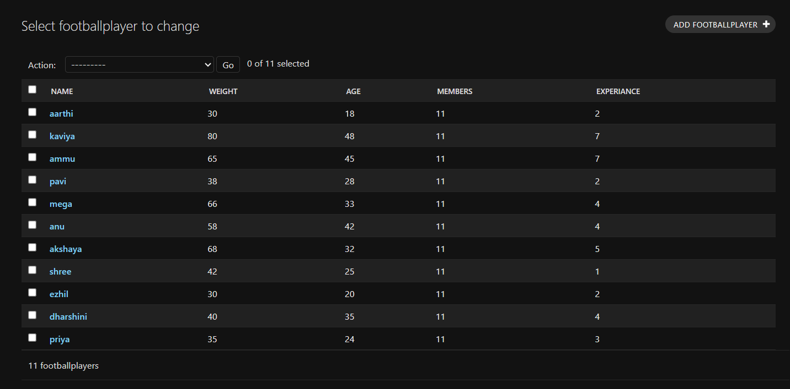

# Ex02 Django ORM Web Application
## Date: 

## AIM
To develop a Django application to store and retrieve data from a Football Players database using Object Relational Mapping(ORM).

## Entity Relationship Diagram

Include your ER diagram here

## DESIGN STEPS

### STEP 1:
Clone the problem from GitHub

### STEP 2:
Create a new app in Django project

### STEP 3:
Enter the code for admin.py and models.py

### STEP 4:
Execute Django admin and create 10 Football players

## PROGRAM
```
models.py

from django.db import models
from django.contrib import admin
class footballplayer (models.Model):
    name=models.CharField(max_length=15)
    weight=models.IntegerField()
    age=models.IntegerField()
    members=models.CharField(max_length=20)
    experiance=models.IntegerField()

class footballplayerAdmin(admin.ModelAdmin):
    list_display=('name','weight','age','members','experiance')

    admin.py
    
from django.contrib import admin
from .models import footballplayer,footballplayerAdmin
admin.site.register(footballplayer,footballplayerAdmin)
```


Include your code here

## OUTPUT




Include the screenshot of your admin page.


## RESULT
Thus the program for creating a database using ORM hass been executed successfully
